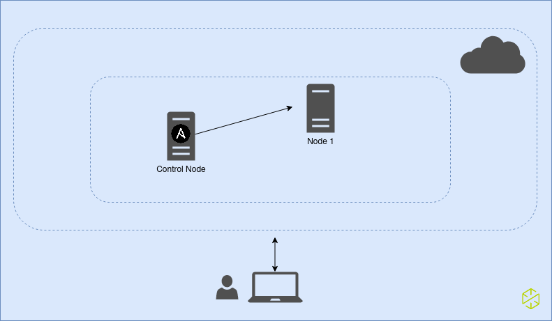
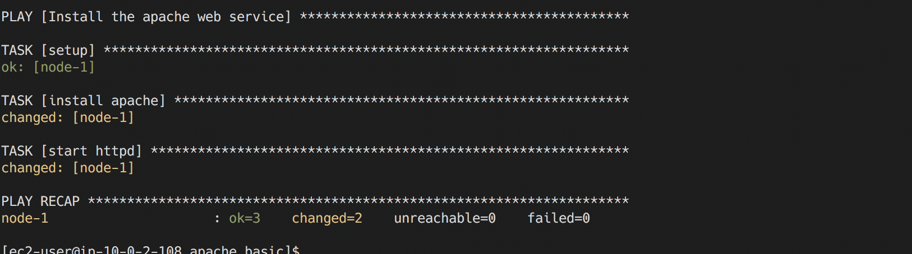
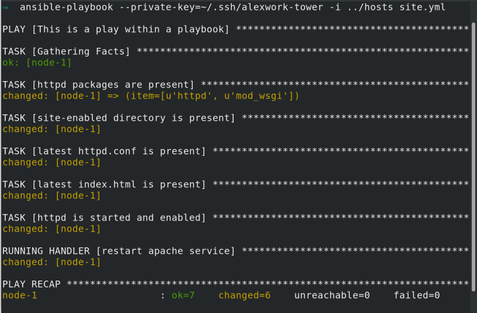
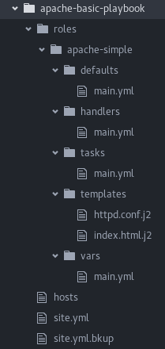
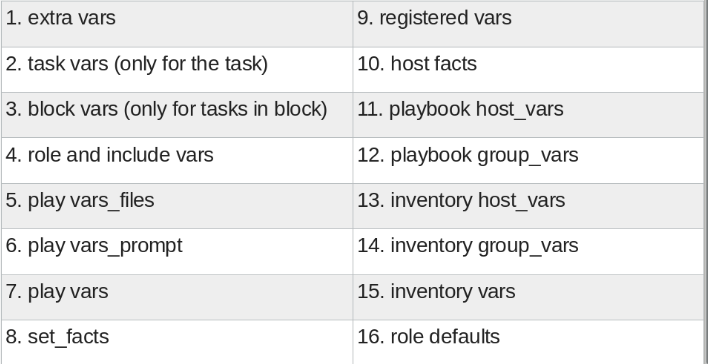
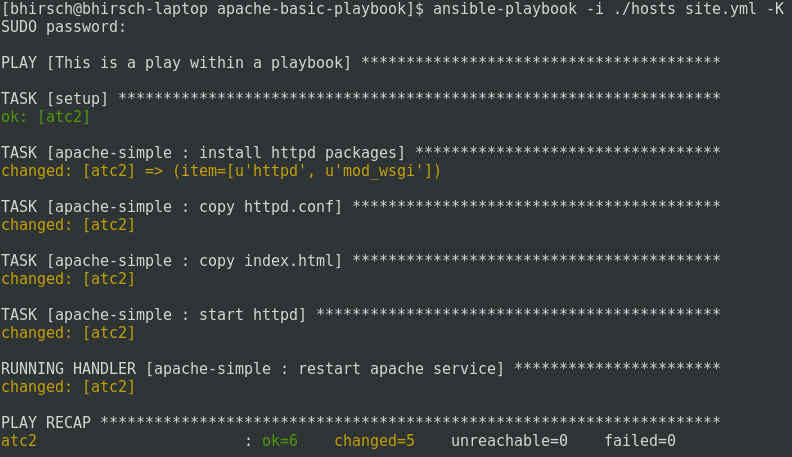

# Ansible-workshop

## Workshop Description.

Ansible permite la creación de playbooks mientras construye seguridad. Las funciones de automatización ahorran tiempo, capacitan al personal junior, descargan trabajo al personal senior y automatiza las tareas más tediosas y repetitivas.

 ## Que vas a aprender

- Que es Ansible y para que sirve
- Cómo ejecutar comandos ad hoc
- Cómo escribir un playbook
- Cómo reutilizar playbooks a partir de roles

## Visión General

El taller de Ansible automation está destinado a cualquier persona que tena alguna exposición a Ansible, ya sea que lo haya usado o no. Comenzaremos con una breve descripción general y luego realizaremos laboratorios para aprender haciendo.

## Prerequisitos

- 1 maquina virtual  virtual con RHEL 7.x ó 8.x instalación minimal para usar como nodo de control.
- 1 maquina virtual  virtual con RHEL 7.x ó 8.x instalación minimal para usar como nodo gestionado.
- Conectividad entre ambas maquinas así como desde la maquina local.
- Subscribir la maquina virtual que será usada como nodo gestionado y habilitar el canal de JBoss EAP 7

> **Tip**: Pude basarse en el siguiente comando para habilitar el canal de JBoss EAP en el nodo gestionado:
>
> ```bash
> subscription-manager repos --enable=jb-eap-EAP_MINOR_VERSION-for-rhel-RHEL_VERSION-ARCH-rpms
> ```

- Subscribir la maquina virtual que será usada como nodo de control y habilitar el canal de Ansible

  > **Tip**. Pude basarse en el siguiente comando para habilitar el canal de ansible en el nodo de control:
  >
  > ```bash
  > subscription-manager repos --enable ansible-2.9-for-rhel-8-x86_64-rpms.
  > ```

## Ejercicios

1. Preparación entorno de ejecución
2.  Ejecución de comandos ad hoc.
3. Escribir el primer playbook.
4. Ejecutar el playbook.
5. Uso de Variables, Bucles y Handlers.
6. Ejecutar el playbook Apache-basic
7. Roles: hacer que tus playbooks sean reutilizables.
8. Conocer Ansible Tower (No practico)

## Preparación Entorno de Ejecución

La siguiente gráfica simula arquitectura que se trabajara durante este workshop.



Crear el usuario ansible en el servidor **node 1** con permisos para escalar privilegios sin solicitar la contraseña.

```bash
[root@localhost ~]# adduser ansible
[root@localhost ~]# passwd ansible
[root@localhost ~]# echo -e "# Ansible Adminstration User\n \n# User rules for ansible\nansible ALL=(ALL) NOPASSWD:ALL" > /etc/sudoers.d/ansible
```

Configurar el archivo `/etc/hosts` tanto en el **nodo de control** como en el **node 1** para que respondan respectivamente por los nombres **control.example.com** y **node1.example.com**. 

En el servidor ansible **nodo de control** con el usuario devops crea una llave ssh y establece el acceso con esta hacia el servidor **node 1**.

```bash
[devops@localhost ~]$  ssh-keygen -N ''
[devops@localhost ~]$  ssh-copy-id ansible@node1.example.com
```

Instale **Ansible** en el nodo de control

```bash
[root@localhost ~]# dnf -y install ansible
```


## Ejecución de comandos ad-hoc

### Descripción del ejercicio.

Para nuestro primer ejercicio, vamos a ejecutar algunos comandos ad-hoc para ayudarlo a tener una idea de cómo funciona Red Hat Ansible. Los comandos especiales ad-hoc le permiten realizar tareas repetitivas en nodos remotos, sin tener que escribir un playbook. Son muy útiles cuando simplemente necesita realizar una o dos tareas de forma rápida y frecuente en varios nodos remotos.

#### Configurar dependencias:

Define tu inventario. Los inventarios son cruciales para Ansible, ya que definen máquinas remotas en las que ejecutará comandos o sus Playbooks. Use `vi` o `vim` para crear un archivo llamado  `inventory`. Luego, agregue las definiciones apropiadas para el nodo que funcionará como un nodo web.

*inventory (ejemplo)*

```ini
[web]
{node ip}
```

Donde `node ip` corresponde a la IP que vamos a usar como nodo controlado.

#### Paso 1: prueba la respuesta de webhost

Comencemos con algo básico: hacer ping a un host. El módulo `ping` prueba la capacidad de respuesta de nuestro servidor web.

```bash
ansible web -m ping
```

#### Paso 2: ejecuta un comando de Linux

Ahora veamos cómo podemos ejecutar un comando de Linux y formatear la salida, usando el módulo `command`.

```bash
ansible web -m command -a "uptime" -o
```

#### Paso 3: revise el módulo de configuración

Eche un vistazo a la configuración de su nodo web.  El módulo `setup` muestra datos de Ansible (y muchos de ellos) sobre un punto final.

```bash
ansible web -m setup
```

> **Nota**: 	Al igual que muchos comandos de Linux `Ansible` permite opciones de formato largo, así como de formato corto. Por ejemplo:
>
> ```bash
> ansible web --module-name ping
> ```
>
> El comando anterior es el mismo que ejecutar el siguiente comando.
>
> ```bash
> ansible web -m ping
> ```
>
> Vamos a utilizar las opciones de formato corto a lo largo de este taller.

#### Paso 4:  Instale Maven, git, y Red Hat JBoss EAP

Ahora,  instalemos Maven & Git, usando el módulo `dnf`.

```bash
ansible web -m dnf -a 'name=git state=present' -b
ansible web -m dnf -a "name='@maven:3.5/common' state=present" -b
ansible web -m dnf -a "name=@jboss-eap7 state=present" -b
```

#### Paso 5: Inicie JBoss EAP

JBoss EAP está instalado ahora, así que iniciémolo usando el módulo `service`.

```bash
ansible web -m service -a "name=eap7-standalone state=started" -b
```

#### Paso 6:  Implemente una aplicación

A continuación, implementaremos una aplicación.

En aras de la simplicidad, utilizaremos un inicio rápido existente. Para comenzar, revisamos un código ...

```bash
ansible web -m git -a "repo=https://github.com/jboss-developer/jboss-eap-quickstarts.git dest=/tmp/checkout"
```

Implemente el código a través de Maven, proporcionado por Red Hat Application Streams.

```bash
ansible web -m shell -a 'mvn clean install wildfly:deploy -Dmaven.test.skip=true chdir=/tmp/checkout/helloworld' -b
```

Sitio de demostración (prueba unitaria):

```bash
ansible web -m uri -a "url=http://localhost:8080/helloworld/ return_content=yes"
```

Sitio de demostración (abra esto en su navegador web):

```
http://{ip_servidor_node1}:8080/helloworld/
```

#### Paso 7: limpieza

Finalmente, limpiemos el trabajo. Primero, detenga el servicio de JBoss EAP, utilizando el siguiente comando.

```bash
ansible web -m service -a "name=eap7-standalone state=stopped" -b
```

#### Paso 10: eliminar paquetes

A continuación, elimine algunos paquetes, de la siguiente manera.

```bash
ansible web -m dnf -a "name=@jboss-eap7 state=absent" -b
ansible web -m dnf -a "name=eap7-* state=absent" -b
ansible web -m dnf -a "name=maven state=absent" -b
ansible web -m dnf -a "name=git state=absent" -b
```

## Escribir el primer playbook.

### Descripción del ejercicio

Ahora que tiene una idea de cómo funciona Red Hat Ansible, vamos a escribir nuestro primer playbook de Ansible. El playbook es donde puedes tomar algunos de esos comandos ad hoc que acabas de ejecutar y ponerlos en un conjunto repetible de **Plays** y **Task**.

Un playbook puede tener varios plays y un play puede tener una o varias tareas. El objetivo de un **play** es mapear un grupo de host. El objetivo de una **tarea** es implementar módulos contra esos hosts.

Para nuestro primer playbook, solo vamos a escribir un play y dos tareas.

### Sección 1: Crear una estructura de directorios y archivos para tu playbook.

Hay un [best practices](https://docs.ansible.com/ansible/latest/user_guide/playbooks_best_practices.html) respecto a las estructuras de directorio preferidas para los playbooks. Le recomendamos encarecidamente que lea y comprenda estas prácticas a medida que desarrolla sus habilidades ninja en Ansible. Dicho esto, nuestro playbook hoy es muy básico, porque crear una estructura compleja puede crear desafíos innecesarios.

En su lugar, vamos a crear una estructura de directorio muy simple para nuestro playbook y agregarle solo un par de archivos.

#### Paso 1: crea un directorio

Cree un directorio llamado **apache_basic** en su directorio de inicio y cambié a este.

```bash
mkdir ~/apache_basic
cd ~/apache_basic
```

#### Paso 2: cree la instalación de Apache

Use `vi` o `vim` para crear un archivo llamado **install_apache.yml**

### Sección 2: Definiendo tu play

Ahora que estás editando **install_apache.yml**, comencemos definiendo el play.  Luego, nos tomaremos un tiempo para comprender lo que hace cada línea.

```yaml
---
- hosts: web
  name: Install the apache web service
  become: yes
```

- `---` Define el comienzo de YAML (opcional)
- `hosts: web` Define el grupo de host en tu inventario en el que se ejecutará este play.
- `name: Install the apache web service` Describe nuestro play.
- `become: yes` Habilita la escalada de privilegios de usuario. El valor predeterminado es sudo, pero también se admiten su, pbrun y [muchos otros](https://docs.ansible.com/ansible/latest/user_guide/become.html).

### Sección 3: Agregar tareas a tu play

Ahora que hemos definido el play , agreguemos algunas tareas para hacer algunas cosas. Alinea verticalmente la **t** de **task** con la **b** de **become**.

Sí, en realidad importa. De hecho, debe asegurarse de que todas las declaraciones de su playbook estén alineadas, como se muestra.

Si desea ver el playbook completo como referencia, salte al final de este ejercicio.

```yaml
tasks:
 - name: install apache
   package:
     name: httpd
     state: present

 - name: start httpd
   service:
     name: httpd
     state: started
```

- `tasks:` Esto denota que una o más tareas están por definirse
- `- name:` Cada tarea requiere un nombre, que se imprimirá en la salida estándar cuando ejecute su playbook. Por lo tanto, asigne a sus tareas un nombre que sea breve, dulce y al grano.

```yaml
package:
  name: httpd
  state: present
```

- Estas tres lineas llaman al módulo de Ansible `package` para instalar httpd. [Haga clic aquí](https://docs.ansible.com/ansible/latest/modules/package_module.html) para ver todas las opciones para el módulo `package`.

```yaml
service:
  name: httpd
  state: started
```

- as siguientes líneas están utilizando el módulo de Ansible `service` para iniciar el servicio httpd. El módulo `service` es la forma preferida de controlar los servicios en hosts remotos. [Haga clic aquí](https://docs.ansible.com/ansible/latest/modules/service_module.html) para obtener más información sobre el módulo `service` .

### Sección 4: Guardar tu playbook

Ahora que ha terminado de escribir su libro de jugadas, sería una pena no guardarlo para su uso posterior.

Utilizar el  método `write/quit` en `vi` o `vim` para guardar su playbook, es decir `Esc :wq!`

Ahora debería tener un playbook totalmente escrito llamado `install_apache.yml`. ¡Estás listo para automatizar!

> **Nota**: Ansible (bueno, YAML realmente) puede ser un poco particular sobre el formato, especialmente alrededor de la sangría/espaciado. Lea un poco sobre la [sintaxis de YAML](https://docs.ansible.com/ansible/latest/reference_appendices/YAMLSyntax.html) le horrará algunos dolores de cabeza más adelante. Mientras tanto, su libro de jugadas completo debería verse así. Tome nota del espacio y la alineación.

```yaml
---
- hosts: web
  name: Install the apache web service
  become: yes

  tasks:
    - name: install apache
      package:
        name: httpd
        state: present

    - name: start httpd
      service:
        name: httpd
        state: started
```

## Ejecutar el Playbook

### Sección 1: Ejecutando el playbook

Ahora vamos a ejecutar su nuevo playbook, en su nodo web. Para hacer esto, vas a usar el comando **ansible-playbook**.

#### Paso 1: ejecuta tu playbook

Desde el directorio de tu playbook `( ~/apache_basic )`, ejecuta el siguiente comando.

```bash
ansible-playbook -i ../hosts install_apache.yml --private-key=~/.ssh/id_rsa
```

Sin embargo, antes de ejecutar ese comando, tomemos unos minutos para comprender las opciones.

- `--private-key` Esta opción solicita la clave ssh privada para conectarse a la máquina remota.

- `-i` Esta opción le permite especificar el archivo de inventario que desea usar.

- `-v` Aunque no se usa aquí, esto aumenta la verbosidad. Intente ejecutar su playbook por segunda vez usando `-v` o `-vv` para aumentar la verbosidad (información de depuración).

- `--syntax-check` Si encuentra algún problema con su playbook esta opción podrá ayudarle a verificar que no se presente algún error de sintaxis con el archivo.

  ```bash
  ansible-playbook -i ../hosts install_apache.yml --syntax-check --private-key=~/.ssh/id_rsa
  ```

Ahora, ejecute su libro de jugadas como se especifica en el **Paso 1**

En la salida estándar, debería ver algo que se parece mucho a lo siguiente:



Observe que el play y cada tarea se nombran, para que pueda comprender la acción que se realiza y el nodo en el que se realiza. También puede notar una tarea que no escribió `setup`. Esto se debe a que el módulo `setup` se ejecuta por defecto. Para desactivarlo, puede especificar `gather_facts: false` en su definición de play de esta manera:

```yaml
---
- hosts: web
  name: Install the apache web service
  become: yes
  gather_facts: false
```

#### Paso 2: eliminar Apache

Ahora, experimentemos un poco. Nos gustaría que revierta lo que ha hecho (es decir, detener y desinstalar apache en su nodo web). Por lo tanto, edite su playbook y luego, cuando haya terminado, vuelva a ejecutarlo, como se describe en el **Paso 1** . Para este ejercicio no le mostraremos línea por línea, pero le daremos algunas pistas.

- Si su primera tarea en el playbook fue instalar httpd y la segunda tarea fue iniciar el servicio, ¿en qué orden cree que deberían estar esas tareas ahora?
- Si `started` se asegura de que se inicie un servicio, entonces, ¿qué opción asegura que se detenga?
- Si `present` asegura de que el paquete esté instalado, entonces, ¿qué opción asegura que se elimine? 

Siéntase libre de navegar por las páginas de ayuda para ver una lista de todas las opciones.

- [Ansible package module](https://docs.ansible.com/ansible/latest/modules/package_module.html)
- [Ansible service module](https://docs.ansible.com/ansible/latest/modules/service_module.html)

## Uso de Variables, Bucles y Handlers.

### Descripción del ejercicio

En ejercicios anteriores, le mostramos los conceptos básicos del núcleo Ansible. En los próximos ejercicios, vamos a enseñar algunas habilidades Ansible más avanzadas que agregarán flexibilidad y potencia a sus playbooks.

Ansible existe para hacer que las tareas sean **simples** y **repetibles**. También sabemos que no todos los sistemas son exactamente iguales y, a menudo, requieren una ligera personalización para la forma en que se ejecuta un playbook de Ansible. Las variables, los bucles y los handlers facilitan la personalización.

Las `variables` se utilizan para abordar las diferencias entre sus sistemas, lo que le permite dar cuenta de un cambio en el puerto, la dirección IP o el directorio.

Los `bucles` nos permiten repetir la misma tarea una y otra vez. Por ejemplo, supongamos que desea instalar 10 paquetes. Al usar un bucle Ansible, puede hacerlo en una sola tarea.

Los `handlers` son la forma en que reiniciamos los servicios. ¿Acabas de implementar un nuevo archivo de configuración, instalar un nuevo paquete? Si es así, es posible que deba reiniciar un servicio para que esos cambios surtan efecto. Hacemos eso con un handler.

Para una comprensión completa de variables, bucles y handlers; Consulte la documentación de Ansible sobre estos temas.

- [Ansible Variables](https://docs.ansible.com/ansible/latest/user_guide/playbooks_variables.html)
- [Ansible Loops](https://docs.ansible.com/ansible/latest/user_guide/playbooks_loops.html)
- [Ansible Handlers](https://docs.ansible.com/ansible/latest/user_guide/playbooks_intro.html#handlers-running-operations-on-change)

### Sección 1: Ejecutando el playbook

Para comenzar, vamos a crear un nuevo playbook, pero debería resultarle muy familiar al que creó en el ejercicio   anterior.

Ahora vamos a ejecutar el nuevo playbook, en su nodo web. Para hacer esto, vas a usar el comando `ansible-playbook`.

#### Paso 1: crea un nuevo proyecto y playbook

Navegue a su directorio de inicio para crear un nuevo proyecto y playbook.

```bash
cd
mkdir apache-basic-playbook
cd apache-basic-playbook
vim site.yml
```

#### Paso 2: agrega una definición de play y variables

Agregue una definición de play y algunas variables a su playbook. Estos incluyen paquetes adicionales que su playbook  instalará en sus servidores web, además de algunas configuraciones específicas del servidor web.

```yaml
  tasks:
    - name: install httpd packages
      package:
        name: "{{ item }}"
        state: present
      with_items: "{{ httpd_packages }}"
      notify: restart apache service
```

#### Paso 3: agrega una tarea

Agregue una nueva tarea llamada `install httpd packages`.

```yaml
  tasks:
    - name: install httpd packages
      package:
        name: "{{ item }}"
        state: present
      with_items: "{{ httpd_packages }}"
      notify: restart apache service
```

> **Nota**: Explicación de las acciones de la tarea  install httpd packages.
>
> - `vars:` le has dicho a Ansible que lo siguiente que verá será un nombre variable
> - `httpd_packages` Está definiendo una variable de tipo lista llamada httpd_packages. Lo que sigue es una lista de esos paquetes
> - `{{ item }}` }} Le está diciendo a Ansible que esto se expandirá en un elemento de lista como **httpd** y **mod_wsgi**.
> - `with_items: "{{ httpd_packages }}"` Este es el bucle, que está instruyendo Ansible para realizar esta tarea en cada **item** en **httpd_packages**
> - `notify: restart apache service` Esta declaración es un `handler`, sí que volveremos a verlo en la Sección 3.

### Sección 2: Implementar archivos e iniciar un servicio

Cuando necesite hacer casi cualquier cosa con archivos y directorios, use uno de los módulos de [Ansible Files](https://docs.ansible.com/ansible/latest/modules/list_of_files_modules.html).  En este caso, aprovecharemos los módulos `file` y `template`.

Después de eso, definirá una tarea para iniciar el servicio apache.

#### Paso 1: crea un directorio de templates

Crea un directorio `templates` en el directorio de su proyecto y descargue dos archivos.

```bash
mkdir templates
cd templates
curl -O https://raw.githubusercontent.com/ansible/lightbulb/master/examples/apache-basic-playbook/templates/httpd.conf.j2
curl -O https://raw.githubusercontent.com/ansible/lightbulb/master/examples/apache-basic-playbook/templates/index.html.j2
```

#### Paso 2: Agregar tareas de archivo y servicio

```yaml
    - name: create site-enabled directory
      file:
        name: /etc/httpd/conf/sites-enabled
        state: directory

    - name: copy httpd.conf
      template:
        src: templates/httpd.conf.j2
        dest: /etc/httpd/conf/httpd.conf
      notify: restart apache service

    - name: copy index.html
      template:
        src: templates/index.html.j2
        dest: /var/www/html/index.html

    - name: start httpd
      service:
        name: httpd
        state: started
        enabled: yes
```

> **Nota**: ¿Qué acciones realiza el playbook que acabamos de escribir?
>
> - `file:` Este módulo se utiliza para crear, modificar, eliminar archivos, directorios y enlaces simbólicos.
> - `template:` Este módulo especifica que se está utilizando y desplegando una plantilla jinja2. `template` es parte de la familia de módulos `Files` y le recomendamos que consulte todos los demás [módulos de administración de archivos aquí](https://docs.ansible.com/ansible/latest/modules/list_of_files_modules.html).
> - `jinja-quien?` [jinja2](https://docs.ansible.com/ansible/latest/user_guide/playbooks_templating.html) se usa en Ansible para transformar datos dentro de una expresión de plantilla, es decir, filtros.
> - `service:` el módulo service inicia/detiene/reinicia los servicios 

### Sección 3: Definición y uso de handlers

A menudo, es posible que necesitemos reiniciar un servicio o proceso. Las razones pueden incluir la implementación de un archivo de configuración, la instalación de un nuevo paquete, etc. Aquí, aprenderemos sobre el uso de handlers en esta situación.

Realmente hay dos partes en esta sección; agregar un handler al playbook y llamarlo después de la tarea. Comenzaremos con el primero.

### Paso 1: definir un handler

```yaml
  handlers:
    - name: restart apache service
      service:
        name: httpd
        state: restarted
        enabled: yes
```

> - `handler:` Esto le dice al **play** que el `task:`, y ahora estamos definiendo `handlers:`.  Todo lo que aparece debajo se parece a cualquier otra tarea, es decir, le da un nombre, un módulo y las opciones para ese módulo. Esta es la definición de un handler

Paso 2: llamar el handler

> - `notify: restart apache service`... los `notify` invocan un handler por nombre. ya notaste que has agregado un `notify` a la tarea **copy httpd.conf**, ahora sabes por qué.


### Sección 4: Revisión

¡Tu nuevo y mejorado playbook está listo! Pero no lo ejecute todavía,  haremos en nuestro próximo ejercicio. Por ahora, echemos un segundo vistazo para asegurarnos de que todo se vea de la manera deseada. Si no, ahora es el momento de arreglarlo. La siguiente figura muestra recuentos de líneas y espaciado.

```yaml
---
- hosts: web
  name: This is a play within a playbook
  become: yes
  vars:
    httpd_packages:
      - httpd
      - mod_wsgi
    apache_test_message: This is a test message
    apache_webserver_port: 80

  tasks:
    - name: httpd packages are present
      package:
        name: "{{ item }}"
        state: present
      with_items: "{{ httpd_packages }}"
      notify: restart apache service

    - name: site-enabled directory is present
      file:
        name: /etc/httpd/conf/sites-enabled
        state: directory

    - name: latest httpd.conf is present
      template:
        src: templates/httpd.conf.j2
        dest: /etc/httpd/conf/httpd.conf
      notify: restart apache service

    - name: latest index.html is present
      template:
        src: templates/index.html.j2
        dest: /var/www/html/index.html

    - name: httpd is started and enabled
      service:
        name: httpd
        state: started
        enabled: yes

  handlers:
    - name: restart apache service
      service:
        name: httpd
        state: restarted
        enabled: yes
```


## Ejecutar el playbook Apache-basic

¡Felicidades! Acaba de escribir un playbook que incorpora algunos conceptos clave de Ansible que utiliza en la mayoría de sus futuros playbooks, si no en todos. Sin embargo, antes de que te emociones demasiado, probablemente deberíamos asegurarnos de que realmente se ejecute. Entonces, hagámoslo ahora.

### Sección 1: Ejecuta tu nuevo libro de jugadas de apache

#### Paso 1: crear un archivo host

Asegúrese de estar en el directorio correcto y cree un archivo host.

```bash
cd ~/apache-basic-playbook
```

> **Nota**: Como ya hizo el trabajo de crear un archivo host en en la lección, no dude en volver a usarlo.

#### Paso 2: ejecuta tu playbook

Ejecute su playbook, utilizando el siguiente comando.

```bash
ansible-playbook -i ../hosts site.yml --private-key=~/.ssh/id_rsa
```

### Sección 2: Revisión

Si tiene éxito, debería ver una salida estándar que se parece mucho a la siguiente. Si no, solo háganos saber. Ayudaremos a arreglar las cosas.



## Roles: hacer que tus playbooks sean reutilizables.

### Descripción del ejercicio

Si bien es posible escribir un playbook en un archivo, como lo hemos hecho a lo largo de este taller, eventualmente querrá reutilizar archivos y comenzar a organizar las cosas.

La función de "rol" en Ansible es la forma en que lo podemos hacer. Cuando crea un rol, deconstruye su playbook en partes y esas partes se sientan en una estructura de directorio. 

Para este ejercicio, tomará el playbook que acaba de escribir y lo refactorizará. Además, aprenderá a usar Ansible Galaxy.

Comencemos por comprender cómo su playbook de apache básico se descompondrá en un rol.



Afortunadamente, no tiene que crear todos estos directorios y archivos a mano. Ahí es donde entra en juego Ansible Galaxy.

### Sección 1: Uso de Ansible Galaxy para inicializar un nuevo rol

Ansible Galaxy es un sitio gratuito para buscar, descargar y compartir roles. También es bastante útil para crearlos, que es lo que estamos a punto de hacer.

#### Paso 1: navega a tu proyecto

Be a tu proyecto `apache-basic-playbook`

```bash
cd ~/apache-basic-playbook
```

#### Paso 2: crea un directorio

Cree un directorio llamado `roles` y párese en él.

```bash
mkdir roles
cd roles
```

#### Paso 3: Inicializa un nuevo rol

Utilizar el comando `ansible-galaxy` para inicializar un nuevo rol llamado `apache-simple`.

```bash
ansible-galaxy init apache-simple
```

Eche un vistazo a la estructura que acaba de crear. Debería parecerse mucho a la figura anterior. Sin embargo, debemos completar un paso más antes de pasar a la Sección 2. Es una práctica recomendada de Ansible limpiar los directorios y archivos de roles que no utilizará. borre los directorios `files` y `tests`.

#### Paso 4: eliminar directorios

Eliminar los directorios `files` y `tests`

```bash
cd ~/apache-basic-playbook/roles/apache-simple/
rm -rf files tests
```

### Sección 2:  integra tu playbook `site.yaml` en el recién creado rol `apache-simple`

En esta sección, separaremos las partes principales de tu playbook, incluyendo `vars:`, `tasks:`, `template:` y `handlers:`.

#### Paso 1: copia de seguridad

Haga una copia de respaldo de `site.yml`, luego cree un nuevo `site.yml`.

```bash
cd ~/apache-basic-playbook
mv site.yml site.yml.bkup
vim site.yml
```

#### Paso 2: Agregar play definition/Invoke role

Agregue la definición del play y la  la invocación de un solo rol.

```yaml
---
- hosts: web
  name: This is my role-based playbook
  become: yes

  roles:
    - apache-simple
```

#### Paso 3: Agregar variables predeterminadas

Agregue algunas variables predeterminadas a su rol en `roles/apache-simple/defaults/main.yml`.

```yaml
apache_test_message: This is a test message
apache_webserver_port: 80
```

#### Paso 4: agregar variables

Agregue algunas variables específicas de rol a su rol en `roles/apache-simple/vars/main.yml`.

```yaml
httpd_packages:
  - httpd
  - mod_wsgi
```

> ¿Acabamos de colocar variables en dos lugares diferentes? Sí... sí lo hicimos. Las variables pueden vivir en bastantes lugares. Sólo para nombrar unos pocos:
>
> - vars directory
> - defaults directory
> - group_vars directory
> - En un playbook bajo la sección `vars:`
> - En cualquier archivo que se pueda especificar en la línea de comando usando la opción `--extra_vars`.
>
> debe leer sobre la [precedencia de las variables](https://docs.ansible.com/ansible/latest/user_guide/playbooks_variables.html#variable-precedence-where-should-i-put-a-variable) para comprender dónde definir las variables y qué ubicaciones tienen prioridad. En este ejercicio, estamos utilizando valores predeterminados de roles para definir un par de variables y estas son las más maleables. Después de eso, definimos algunas variables en `/vars` que tienen una precedencia más alta que los valores predeterminados y no se pueden anular como una variable predeterminada.
>
> A modo de información podemos ver en la siguiente imagen la prioridad de las variables.
>
> 

#### Paso 5: Crear handlers de roles

Crea tu controlador de roles en `roles/apache-simple/handlers/main.yml`.

```yaml
- name: restart apache service
  service:
    name: httpd
    state: restarted
    enabled: yes
```

#### Paso 6: Agregar tareas de rol

Agregue tareas a su rol en  `roles/apache-simple/tasks/main.yml`.

```yaml
- name: install httpd packages
  package:
    name: "{{ item }}"
    state: present
  with_items: "{{ httpd_packages }}"
  notify: restart apache service

- name: create site-enabled directory
  file:
    name: /etc/httpd/conf/sites-enabled
    state: directory

- name: copy httpd.conf
  template:
    src: templates/httpd.conf.j2
    dest: /etc/httpd/conf/httpd.conf
  notify: restart apache service

- name: copy index.html
  template:
    src: templates/index.html.j2
    dest: /var/www/html/index.html

- name: start httpd
  service:
    name: httpd
    state: started
    enabled: yes
```

#### Paso 7: descargue los templates

Descargue un par de plantillas en `roles/apache-simple/templates/`.  Y  luego, limpiemos los templates del ejercicio pasado, eliminando el antiguo directorio templates.

```bash
mkdir -p ~/apache-basic-playbook/roles/apache-simple/templates/
cd ~/apache-basic-playbook/roles/apache-simple/templates/
curl -O https://raw.githubusercontent.com/ansible/lightbulb/master/examples/apache-basic-playbook/templates/httpd.conf.j2
curl -O https://raw.githubusercontent.com/ansible/lightbulb/master/examples/apache-basic-playbook/templates/index.html.j2
rm -rf ~/apache-basic-playbook/templates/
```

### Sección 3: Ejecuta tu nuevo playbook basado en roles

Ahora que ha separado con éxito su playbook original en un rol, ejecutémoslo y veamos cómo funciona.

#### Paso 1: ejecuta el playbook

```bash
cd ~/apache-basic-playbook
ansible-playbook -i ../hosts site.yml --private-key=~/.ssh/id_rsa
```

#### Paso 2: verifica tu salida

Si tiene éxito, su salida estándar debería ser similar a la figura a continuación.



### Sección 4: Revisión

Ahora debería tener un playbook completo,  `site.yml` - con un solo rol llamado `apache-simple`. La ventaja de estructurar su playbook en roles es que ahora puede agregar nuevos roles al playbook usando Ansible Galaxy o simplemente escribiendo el suyo. Además, los roles simplifican los cambios en variables, tareas, templates, etc.

